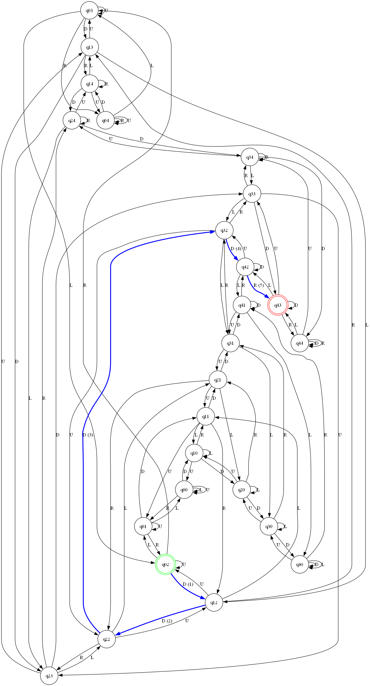

# 🤖 DFA Controlled Robot Navigator v2

A visual simulation of a robot navigating a 5x5 grid based on a **Deterministic Finite Automaton (DFA)**. The robot follows a sequence of directions (`U`, `D`, `L`, `R`) and uses a DFA transition table to determine whether it reaches an **accept state** (goal cell).

---

## 🚀 Features

- ✅ Customizable start and accept states
- 🔁 DFA logic implementation with transition loopbacks for invalid moves
- 🧠 Reads DFA Transition Table from Excel (`.xlsx`)
- 📊 Graphical output of state transitions
- 🧪 Built-in testing module (`test_dfa.py`)

---

## 🗂 Project Structure

```bash
dfa_robot_navigatorv2/
├── dfa.py                  # Core DFA logic
├── dfa_graph.py            # Visualization of the DFA
├── main.py                 # Entry point and controller logic
├── test_dfa.py             # Unit tests
├── DFA_Transition_Table.xlsx  # Excel file for DFA transitions
├── requirements.txt        # Dependencies
├── Output Graph/           # Stores visualized output images
├── my_robot.jpg            # (Optional) Robot illustration
└── README.md               # This file
```

---

## 📦 Installation

1. Clone the repository:
```bash
git clone https://github.com/yourusername/dfa_robot_navigatorv2.git
cd dfa_robot_navigatorv2
```

2. Create a virtual environment (optional but recommended):
```bash
python -m venv venv
venv\Scripts\activate     # On Windows
```

3. Install dependencies:
```bash
pip install -r requirements.txt
```

---

## 🧪 Running the Simulation

```bash
python main.py
```

---

## 📸 Preview

| Grid View | DFA Graph |
|-----------|-----------|
|  |  |

---

## 📈 Future Enhancements

- [ ] Real-time robot animation
- [ ] GUI using Tkinter or PyQt
- [ ] Import/export DFA configurations
- [ ] DFA minimization options

---

## 🧠 Author

**Clay Mark Sarte**  
Passionate about AI, robotics, and software that makes machines think.

---

## 📄 License

This project is licensed under the MIT License.
